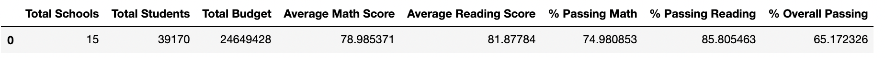
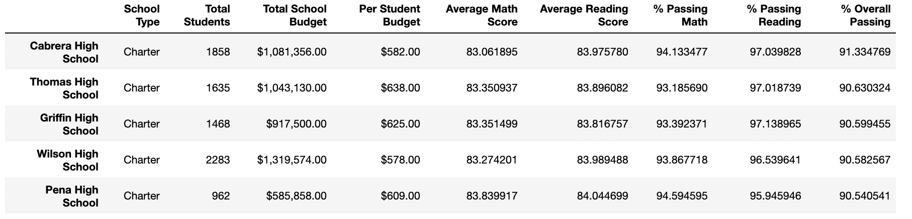
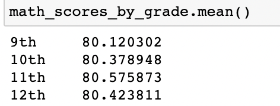
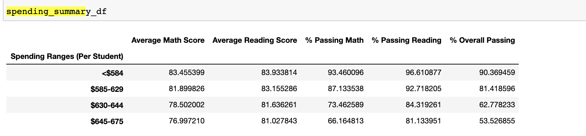
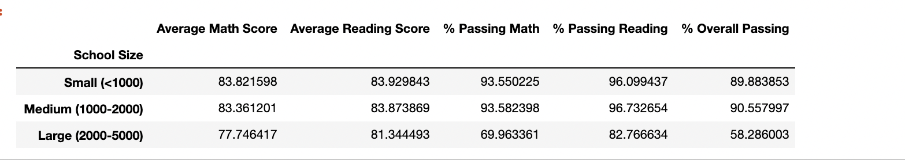

# School_District_Analysis

## Overview of School District Analysis

Maria, who is charged with analysing all standardized test data has asked me for help in her anlaysis of performance, trends and proficiency. The reports that we gather has allowed for the district to make informed decisions based on school size, funding and district to name a few. The initital analysis was very successful although it raised some alarming trents. Our Analysis showed potential for academic dishonesty coming Thomas High School, more specifically the 9th graders. 

Since we do not know the extent of the academic dishonesty it is best to remove the data for now in order to truly analyze our data. Maria has asked that I replace the Thomas High School test scores for both reading and math for the 9th grade with NaN's. Replacing the data with NaNs will keep it from tampering with the rest of our analysis and groupings. Once I replaced the data from our dataframes we ran our analysis again in order to truly analyze the other test scores. 

## Results 

### School District Summary 

Our district summary does not see a dramtic change in terms of the average of the test scores, however when we look at the passing percentages we see a relatively larger effect on the daata. 

Our initial analysis is as follows 

Our new analysis is as follows.

#

we can see that the exludision of the Thomas High School 9th graders caused for a .19 decrease for our "% Passing Math", a .11 decrease for our "% Passing Reading" and a more dramatic .272 decrease in our "% Overall Passing".

### School Summary 

Our school summary does not see much of a difference as expected considering removing Thomas High School does not affect the other schools at all. In factThomas High School held their standing as the second best performing school in our analysis. Thomas High School did see a slight decrease in their performance overall as seen below. The decrease was however not very significant in the performance of Thomas High School relative to the other High Schools.

#

### Math and Reading by Grade

For math scores by grade our original data showed that the mean for the 9th grade was 80.35. The average of the grades of the other grade levels were not affected. 

For reading scores by grade the data showed no difference. This could simply be due to the data for the 9th grade reading scores for Thomas High School was at the average.  

### Bin Analysis 
  
Original analysis for spending was as followed.

$630-$644
- Math percentage = 73.484209	
- Reading percentage = 84.391793
- Overall percentage = 62.8576562

Our new Analysis follows below. All the change originated from the bin where Thomas High School originated from. As expected the perfomance of the bin relative to the others declined. 

#### Scores by school size

  Considering our bins did not change and Thomas High School belonged to the middle bin, this was naturally where we saw the difference in our passing ratings. Our original data showed a math passing rate of 93.599695, 	a reading passing rate of 96.790680, and an overall passing rate of 90.621535. 
  
Our new analysis of bins by school size as we excluded Thomas High School brought the average down once more.

      
## Summary 

Our new analysis does not pose much dramtic change compared to our original analysis. The exlusion of Thomas High School ninth grades seemed to affect the portions where the grades where most prevalent as opposed to other grades. Where "9th" grades were the main source of our analysis was were we saw the biggest changes to our data. The areas most impacted by our new analysis were as follows. 

- School District Summary (percentages)
- Math test scores for 9th graders
- Spending
- Scores by School Size

The removal of Thomas High School 9th grade data is slighly alarming. Not only did the performance of Thomas High School 9th grade scores decrease their overall performance, it decreased the math, reading, and overall passing rates of our analysis as well. The extent of the academic dishonesty is unknown, but it is clear that Thomas High Schools scores were above the average of the other shcools especially those in their same spending and size.

